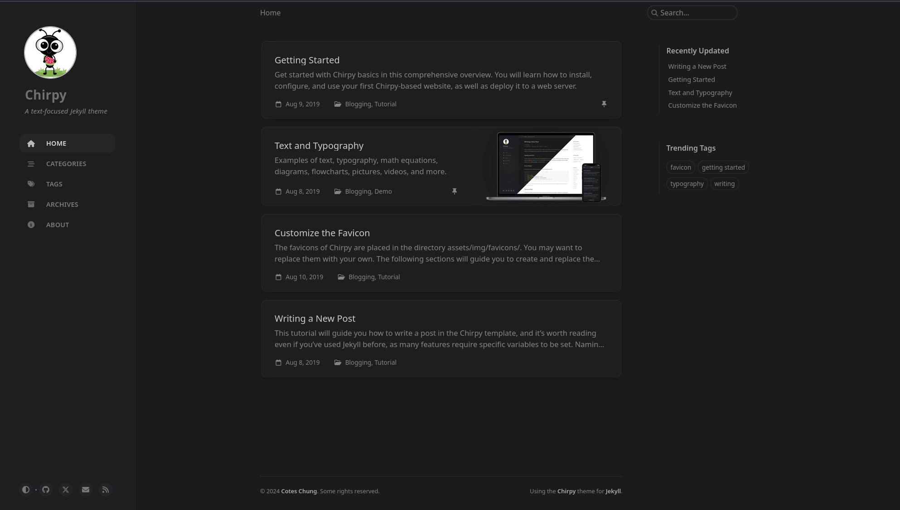
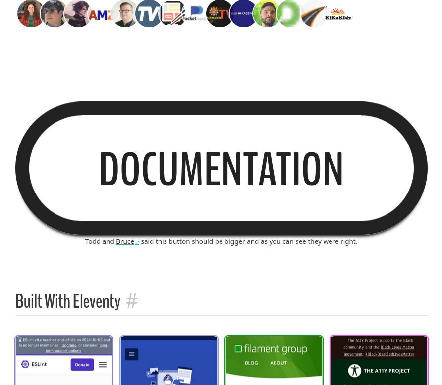

Flashy ⭐⭐⭐ nonsense title aside, I've switched from Jekyll to Astro as my static site generator and wanted to share my reasons behind the switch and my experience with it.

## Background

Previously, my website consisted of only a blog built with [Jekyll](https://jekyllrb.com/) using the [chirpy theme](https://github.com/cotes2020/jekyll-theme-chirpy) without any customization from my end. The theme looks great but now I wanted to add a bit of a personal touch, create a homepage, and customize the styling.

Jekyll is written in Ruby. I don't know Ruby or its ecosystem. While everything I wanted to do right now would be feasible in Jekyll, I wanted to switch to a tool that _I_ can more easily work with, i.e., one that is JavaScript/TypeScript-based. Plus, having a fun small side project certainly was another motivating factor 🙃. So, I went and looked around to see what static site generators (SSG) exist. My requirements were that it is simple and lightweight (no JS by default), not be tied to a specific frontend framework, and little to zero-config. After a bit of research, I narrowed down my choice to [Astro](https://astro.build/) and [Eleventy](https://www.11ty.dev/). While I went with Astro, Eleventy definitely has some benefits over it.

Eleventy has noticeably faster build times (according to Eleventy [themselves](https://www.11ty.dev/docs/performance/#build-performance)). They take 1.93 seconds to build 4.000 markdown files, while Astro needs 22.9 seconds. That's definitely impressive, but not something that matters for my personal website. I doubt I will ever come close to a number of files that would increase the build time to more than a few seconds.

Additionally, [Eleventy's philosophy](https://www.11ty.dev/#why-should-you-use-eleventy) appears more personal and friendly, while Astro feels more professional and corporate. For instance, Eleventy doesn't collect telemetry, while Astro does... but they do ask if you want to opt-out.

But the deciding factor in favor of Astro was the documentation. Astro has a simple hands-on [tutorial to build a blog](https://docs.astro.build/en/tutorial/0-introduction/) on their website. It contains everything you need from A-Z. It's a killer feature. Their sidebar is also structured very well. Eleventy, on the other hand, has a huge sidebar. It contains like 3 times the items of Astro's sidebar. It's overwhelming. Also, their tutorials link to YouTube videos (partially by third parties and partially quite old) or GitHub repos. Both don't feel as well integrated or beginner-friendly as Astro's official on-site, step-by-step tutorial.

That said, one thing I do want to highlight about Eleventy's documentation is that they feature it very prominently on their homepage. It is _hard_ to miss... and it even sticks to the top of the screen when you scroll 😂

## The Experience of Using Astro for the First Time

The developer experience of Astro is amazing. They have a great [tutorial](https://docs.astro.build/en/tutorial/0-introduction/) which only takes about 30 minutes or so and teaches you everything you need to build static sites. If you know HTML, CSS, and JS, you can jump straight into it and you will breeze right through because Astro is very straightforward to use. Their component/templating language is [JSX-like](https://docs.astro.build/en/reference/astro-syntax/), which is nice. After all, JSX is basically just HTML + JS. The only difference I've noticed is that you don't use camelCase but kebab-case, making this even more similar to HTML.

[Styling](https://docs.astro.build/en/guides/styling/) is just CSS, which is scoped by default (nice!). Options for libraries like Tailwind and preprocessors are available when needed.

I didn't need to edit my markdown files to accommodate Astro. In fact, I could even remove `` and `` which came from Jekyll/Liquid. Customizing the markdown-to-HTML build process is possible with [plugins](https://docs.astro.build/en/guides/markdown-content/#markdown-plugins), which you can write yourself. I've used plugins to add a copy button to code sections and to auto-link headings.

Providing an RSS feed for my blog was easy as there is an official package and [guide](https://docs.astro.build/en/recipes/rss/). Deploying to GitHub Pages is just as simple since Astro provides a [workflow template and maintains an official GitHub Action](https://docs.astro.build/en/guides/deploy/github/).

Now let's talk about issues I ran into when using Astro... there were none, which, I guess, isn't surprising. After all, I only used Astro to generate a homepage and a blog, which are the most basic things you can do with a SSG. So I wouldn't expect anyone to run into any issues when using any SSG for that use case. The only challenge was, that I needed to style everything myself, which is the price you pay when you don't use a theme and want to have full control.

[Edit]
Well, just after publishing this post. I've noticed an issue. There is a difference between the dev environment and the production code that runs. The images in the production were broken because I've used absolute paths when referencing them. In the dev environment that worked... 😅
[/Edit]

## Future Plans

My site itself is still a work-in-progress, e.g., I am missing a light mode; there are possible accessibility concerns since I used some `input` element hacks to stick to HTML-and-CSS-only as much as possible; and my project showcase isn't done yet.

As for my usage of Astro, I am pretty happy with that except that I still need to handle videos and images better. Another thing on my TODO list is to explore the [content collections API](https://docs.astro.build/en/guides/content-collections/) because that seems to be the perfect fit for a blog. Let me quote Astro for the benefits of using content collections here

> Collections help to organize and query your documents, enable Intellisense and type checking in your editor, and provide automatic TypeScript type-safety for all of your content.

However, all those things are for future-me. My site works well enough at the moment.

## Hindsight: 20/20

Overall, my switch to Astro went great thanks its simplicity and documentation. I would recommend Astro, it's a 20/20 for me. If you know HTML, CSS, and JS, you need to learn very little to use it. Now I have full control over the look and feel of my website - with all the pros and cons that come with said control.
