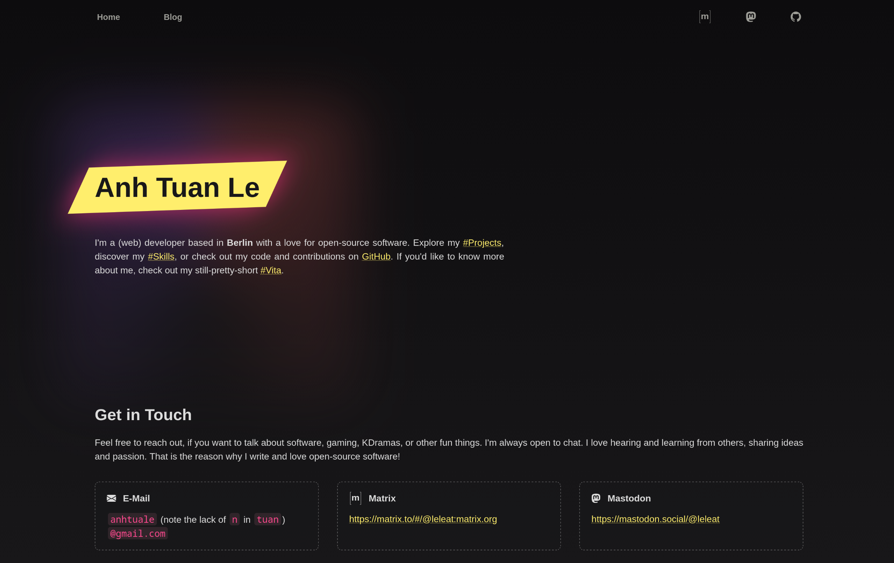
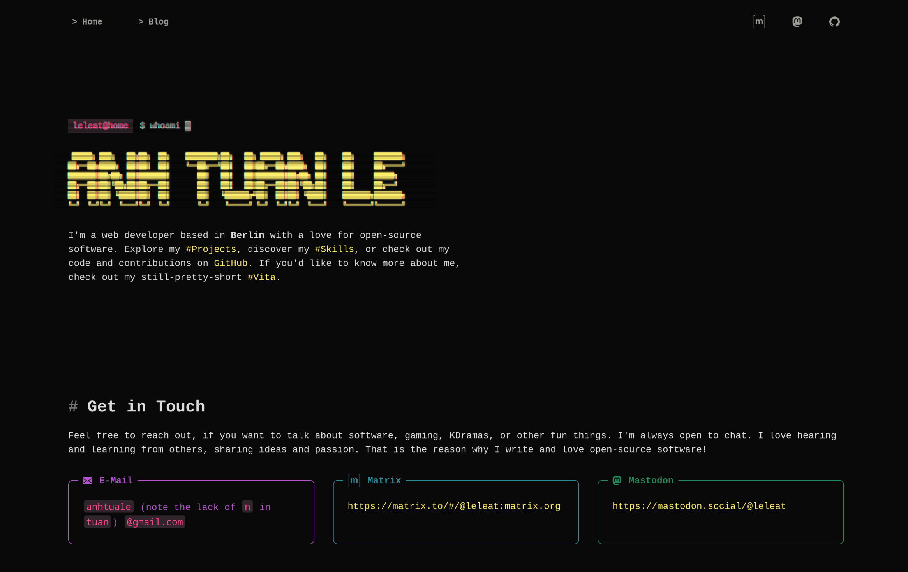
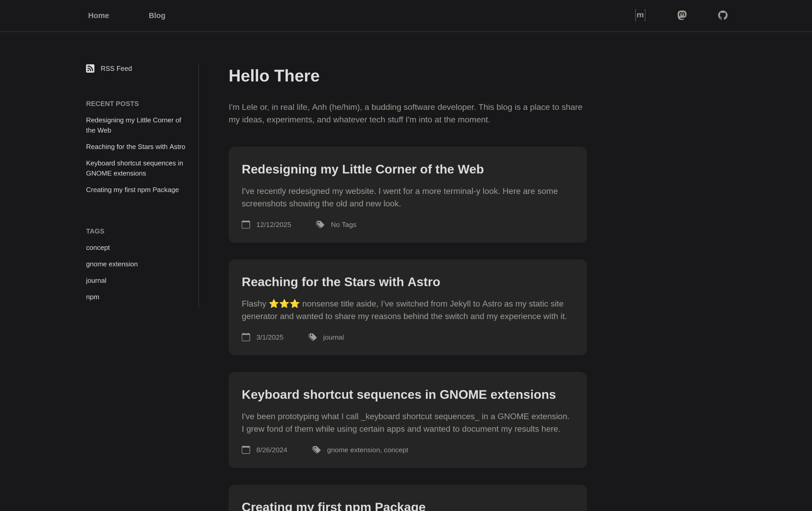
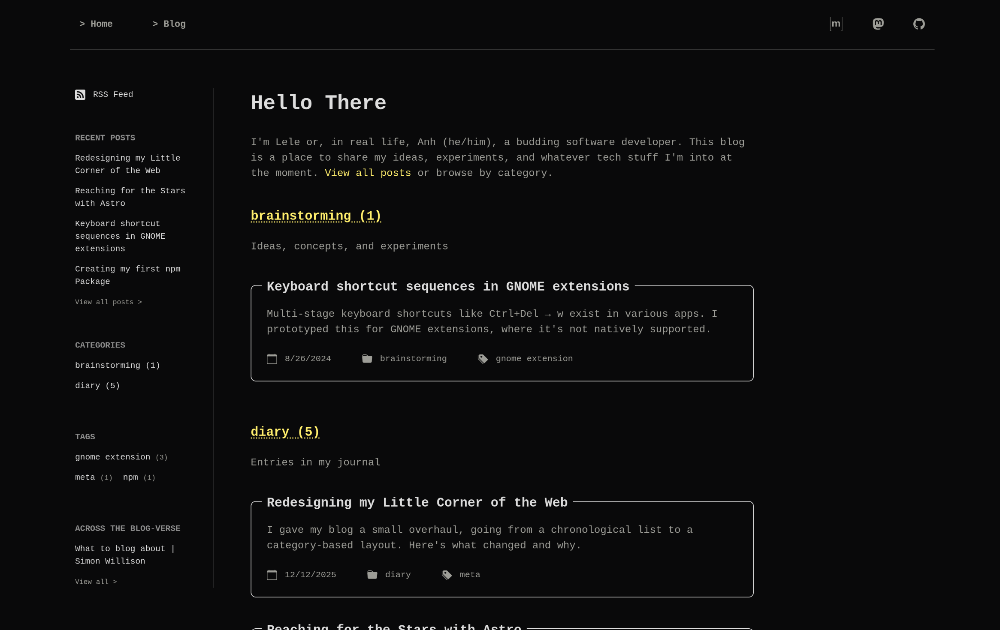

I've recently redesigned my website. I went for a more terminal-y look. Here are some screenshots showing the old and new look.

Layout-wise, my blog used to be very simple: just a list of all my posts in reverse chronological order. Yesterday, I read a [blog post by Lalit Maganti](https://lalitm.com/post/homepage-redesign-light-mode-and-more/) about his own redesign, where he links to a [post by Evan Martin](https://neugierig.org/software/blog/2011/09/blog-format.html). In that post, Martin argues that having a reverse-chronological homepage doesn't really make sense when your writing covers unrelated topics. And I do see his point, which is why I decided to rethink the layout of my blog as well.

Earlier this week, I had already added categories after reading Simon Willison's [What to blog about](https://simonwillison.net/2022/Nov/6/what-to-blog-about/). My categories are few and fixed in number. So they are a natural way to structure the landing page.

So now, the page shows the three most recent posts in each category.

I tried a multi-column layout, but because the category descriptions and post cards vary in length, posts and text were misaligned. I didn't like that, so I went with a single-column design instead. Since the landing page no longer lists all posts, I also added an archive, which is basically the old view: a full reverse-chronological list.

And lastly, loosly inspired by Simon Willison's [Link Blog](https://simonwillison.net/2024/Dec/22/link-blog/) and Blogrolls, I added a section in the sidebar with links to posts I've enjoyed reading. I'm calling it "Across the Blog-verse" (a reference to Across the Spider-Verse). It's a manually curated list, and I'll update it whenever I come across something great. Check it out [here](/blog/blogroll/).
